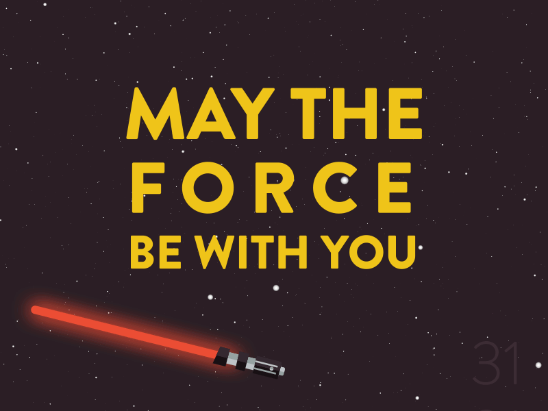

<div align="center">

</div>

# 🌌 Star Wars Universe

This is a star wars project where you can see all the characters data.

This project uses [SWAPI](https://swapi.dev/) to get the characters and its data. Additionally, it uses [starwars-api](https://akabab.github.io/starwars-api/) (from [akabab](https://github.com/akabab)) to get the images.

Additional dependencies:
 - [moment](https://www.npmjs.com/package/moment): to format data.
 - [react-router-dom](https://www.npmjs.com/package/react-router-dom): to manipulate routes.
 - [sass](https://www.npmjs.com/package/sass): to style the project. 

Responsive design.

## 🚀 Getting started

```bash
npm i
npm start
```
Open [http://localhost:3000](http://localhost:3000) to view it in the browser.

## 🧪 Testing


```bash
npm test
```

Launches the test runner in the interactive watch mode.

Enjoy and may the force be with you
